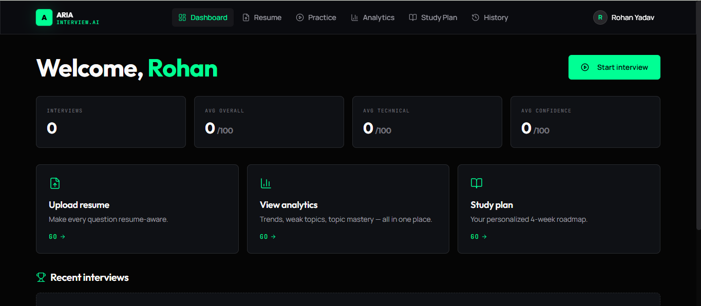

# ARIA – AI Mock Interview Platform

ARIA is an AI-powered mock interview platform that helps students and job seekers prepare for technical and behavioral interviews through personalized interview sessions. Users can upload their resume, practice interviews tailored to their background, receive detailed feedback, track performance over time, and generate study plans based on identified weaknesses.

## Live Demo

**Web App:** https://aimockinterviewapp.netlify.app/

---

## Features

### Resume-Aware Interviews

* Upload resumes in PDF, DOCX, or TXT format
* Extract skills, projects, education, and experience
* Generate interview questions based on resume content

### Multiple Interview Tracks

* HR Interviews
* Data Structures & Algorithms
* Backend Development
* Frontend Development
* System Design
* AI / Machine Learning
* Behavioral Interviews

### Adaptive Interview Flow

* Questions adapt according to previous responses
* Follow-up questions generated dynamically
* Multi-turn interview conversations

### Voice & Text Interaction

* Answer questions through text
* Browser-based speech recognition support
* Live transcription during interviews

### Feedback & Evaluation

* Detailed post-interview analysis
* Category-wise scoring
* Strengths, weaknesses, and improvement suggestions
* Per-question feedback

### Analytics Dashboard

* Interview history tracking
* Performance trends over time
* Category-wise score comparison
* Progress monitoring

### Personalized Study Plans

* Automatically generated learning roadmap
* Recommended topics based on interview performance
* Suggested practice areas

---

## Tech Stack

### Frontend

* React 19
* React Router
* Tailwind CSS
* shadcn/ui
* Framer Motion
* Axios
* Recharts

### Backend

* FastAPI
* Uvicorn
* Pydantic

### Database

* MongoDB Atlas

### Authentication

* JWT Authentication
* bcrypt Password Hashing

### AI Integration

* Google Gemini 2.5 Flash

### Resume Processing

* pypdf
* python-docx

---

## Project Structure

```text
.
├── backend/
│   ├── server.py
│   ├── ai_service.py
│   ├── auth.py
│   ├── models.py
│   ├── resume_parser.py
│   └── requirements.txt
│
├── frontend/
│   ├── public/
│   ├── src/
│   │   ├── components/
│   │   ├── pages/
│   │   ├── hooks/
│   │   ├── lib/
│   │   └── App.js
│   ├── package.json
│   ├── tailwind.config.js
│   └── craco.config.js
│
└── README.md
```

---

## Local Setup

### Prerequisites

* Python 3.11+
* Node.js 18+
* Yarn
* MongoDB Atlas Account
* Gemini API Key

### Backend Setup

```bash
cd backend

python -m venv .venv

# Linux/macOS
source .venv/bin/activate

# Windows
.venv\Scripts\activate

pip install -r requirements.txt
```

Create a `.env` file inside `backend/`:

```env
MONGO_URL=your_mongodb_connection_string
DB_NAME=mock-interview-db

JWT_SECRET=your_secret_key

GEMINI_API_KEY=your_gemini_api_key
GEMINI_MODEL=gemini-2.5-flash
```

Run the backend:

```bash
uvicorn server:app --reload --host 0.0.0.0 --port 8001
```

Backend URL:

```text
http://localhost:8001
```

---

### Frontend Setup

```bash
cd frontend

yarn install
```

Create a `.env` file:

```env
REACT_APP_BACKEND_URL=http://localhost:8001
```

Run the frontend:

```bash
yarn start
```

Frontend URL:

```text
http://localhost:3000
```

---

## Deployment

| Service  | Platform      |
| -------- | ------------- |
| Frontend | Netlify       |
| Backend  | Render        |
| Database | MongoDB Atlas |

---

## Dashboard Preview



---

## Highlights

* Resume-aware interview generation using Gemini
* Adaptive follow-up questioning based on user responses
* Voice and text interview support
* Automated interview evaluation and scoring
* Personalized study-plan generation
* Analytics dashboard for performance tracking
* Secure JWT-based authentication
* Fully deployed using Netlify, Render, and MongoDB Atlas

---

## Planned Improvements

* Integrated coding interview environment
* OAuth login (Google/GitHub)
* Exportable interview reports
* Real-time AI response streaming
* Company-specific interview preparation modes

---

## Author

Rohan Yadav

## Live Application

https://aimockinterviewapp.netlify.app/
